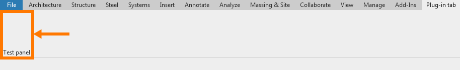

# Quick start guide

## Add Revit plug-in ribbon tab

* Find the starter class where the base interface `IExternalApplication` for your plugin is defined.

* In `OnStartup` method implemented by `IExternalApplication` add 'AddRibbonTab' method, defined in `RevitPluginKit.Ui.RibbonKit`.

	When your plugin is initialized during the start of the Revit session, this method will add a ribbon tab to the Revit upper working panel.

* You can call this method multiple times to create multiple ribbon tabs.

* Example code snippet:

    ```c#
    namespace RevitPluginKitTemplate
    {
        using System.Collections.Generic;
        using Autodesk.Revit.UI;
        using RevitPluginKit.Ui;
        using static RevitPluginKit.Ui.RibbonKit;

        /// <summary>
        /// Main plug-in entry point.
        /// </summary>
        public class PluginMain : IExternalApplication
        {
            /// <inheritdoc/>
            public Result OnShutdown(UIControlledApplication application)
            {
                return Result.Succeeded;
            }

            /// <inheritdoc/>
            public Result OnStartup(UIControlledApplication application)
            {
                AddRibbonTab(
                    application: application,
                    tabName: "Plug-in tab",
                    panelsSettings: new List<RibbonPanelSettings>());
                return Result.Succeeded;
            }
        }
    }
    ```

* As a result, you will see in Revit:


## Add Revit plug-in ribbon panel to ribbon tab

* In the field `panelsSettings` - edit previously instantiated `List<RibbonPanelSettings>()` by adding your first ribbon panel data.

* The `RibbonPanelSettings` class is responsible for defining the revit ribbon panel.

* You can add multiple panels to the current ribbon tab.

* Modified code snippet:

    ```c#
    AddRibbonTab(
                application: application,
                tabName: "Plug-in tab",
                panelsSettings: new List<RibbonPanelSettings>() {
                    new RibbonPanelSettings(
                        name: "Test panel",
                        buttonsSettings: new List<ButtonSettings>()),
                });
    ```

* As a result, you will see in Revit:


