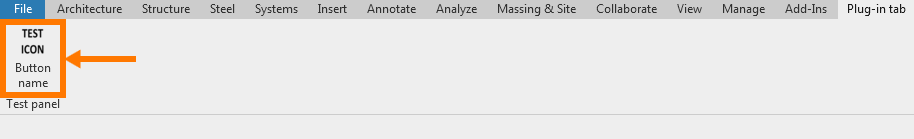
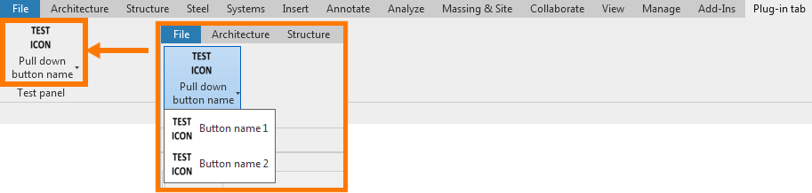

# Quick start guide

## Add Revit plug-in ribbon tab

* Find the starter class where the base interface `IExternalApplication` for your plugin is defined.

* In `OnStartup` method implemented by `IExternalApplication` add 'AddRibbonTab' method, defined in `RevitPluginKit.Ui.RibbonKit`.

	When your plugin is initialized during the start of the Revit session, this method will add a ribbon tab to the Revit upper working panel.

* You can call this method multiple times to create multiple ribbon tabs.

* Example code snippet:

    ```c#
    namespace RevitPluginKitTemplate
    {
        using System.Collections.Generic;
        using Autodesk.Revit.UI;
        using RevitPluginKit.Ui;
        using static RevitPluginKit.Ui.RibbonKit;

        /// <summary>
        /// Main plug-in entry point.
        /// </summary>
        public class PluginMain : IExternalApplication
        {
            /// <inheritdoc/>
            public Result OnShutdown(UIControlledApplication application)
            {
                return Result.Succeeded;
            }

            /// <inheritdoc/>
            public Result OnStartup(UIControlledApplication application)
            {
                AddRibbonTab(
                    application: application,
                    tabName: "Plug-in tab",
                    panelsSettings: new List<RibbonPanelSettings>());
                return Result.Succeeded;
            }
        }
    }
    ```

* As a result, you will see in Revit:


***

## Add Revit plug-in ribbon panel to ribbon tab

* Edit previously instantiated `List<RibbonPanelSettings>()` by adding your first ribbon panel data to the previously created ribbon tab.

* The `RibbonPanelSettings` class is data transfer object responsible for defining the revit ribbon panel.

* You can add multiple panels to the current ribbon tab.

* Modified code snippet:

    ```c#
    AddRibbonTab(
        application: application,
        tabName: "Plug-in tab",
        panelsSettings: new List<RibbonPanelSettings>() {
            new RibbonPanelSettings(
                name: "Test panel",
                buttonsSettings: new List<ButtonSettings>()),
        });
    ```

* As a result, you will see in Revit:


***

## Add Revit plug-in push button to panel

* Edit previously instantiated `List<ButtonSettings>()` by adding your first push button settings (`PushButtonSettings`) to the previously created ribbon panel.

* The `PushButtonSettings` class is data transfer object responsible for defining the revit push button.

* You can add multiple push buttons to the current ribbon panel.

* Modified code snippet:

    ```c#
    AddRibbonTab(
        application: application,
        tabName: "Plug-in tab",
        panelsSettings: new List<RibbonPanelSettings>()
        {
            new RibbonPanelSettings(
                name: "Test panel",
                buttonsSettings: new List<ButtonSettings>()
                {
                    new PushButtonSettings(
                        internalName: "buttonName",
                        name: "Button\nname",
                        tooltip: "Button tooltip",
                        imageAddress: "RevitPluginKitTemplate.assets.icons.TestIcon.png",
                        className: "RevitPluginKitTemplate.Src.TestClass"),
                }),
        });
    ```

* As a result, you will see in Revit:



***

## Add Revit plug-in pull down button to panel

* Edit previously instantiated `List<ButtonSettings>()` by adding your first pull down button settings (`PullDownButtonSettings`) to the previously created ribbon panel.

* The `PullDownButtonSettings` class is data transfer object responsible for defining the revit pull down button.

* You can add multiple pull down buttons to the current ribbon panel.

* Modified code snippet:

    ```c#
    AddRibbonTab(
        application: application,
        tabName: "Plug-in tab",
        panelsSettings: new List<RibbonPanelSettings>()
        {
            new RibbonPanelSettings(
                name: "Test panel",
                buttonsSettings: new List<ButtonSettings>()
                {
                    new PullDownButtonSettings(
                        internalName: "pullDownButtonName",
                        name: "Pull down\nbutton name",
                        tooltip: "Pull down button tooltip",
                        imageAddress: "RevitPluginKitTemplate.assets.icons.TestIcon.png",
                        pushButtonsSettings: new List<PushButtonSettings>()
                        {
                            new PushButtonSettings(
                                internalName: "buttonName1",
                                name: "Button\nname 1",
                                tooltip: "Button tooltip 1",
                                imageAddress: "RevitPluginKitTemplate.assets.icons.TestIcon.png",
                                className: "RevitPluginKitTemplate.Src.TestClass"),
                            new PushButtonSettings(
                                internalName: "buttonName2",
                                name: "Button\nname 2",
                                tooltip: "Button tooltip 2",
                                imageAddress: "RevitPluginKitTemplate.assets.icons.TestIcon.png",
                                className: "RevitPluginKitTemplate.Src.TestClass"),
                        }),
                }),
        });
    ```

* As a result, you will see in Revit:



***

## Next steps

Next, try adding any other instrument from this library to your plugin!

For example, try using the **[element collector](../../docs/api/RevitPluginKit.Collectors.html)** to quickly and easily collect elements in the test model.
